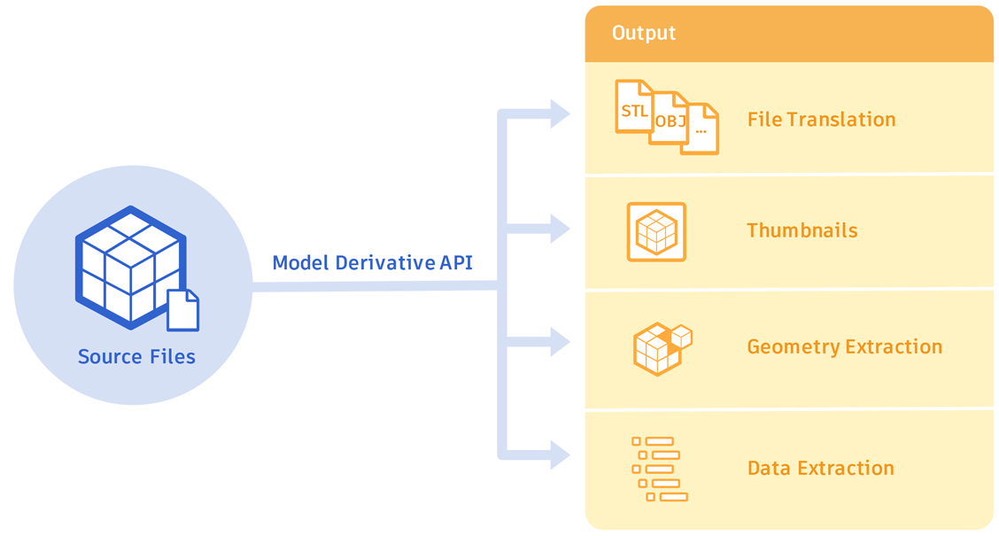
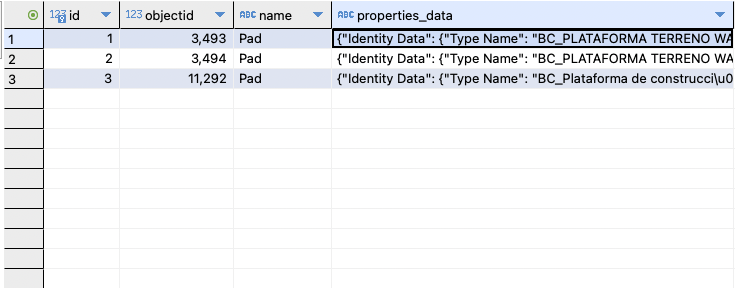

# Revit Data Management & Derivative Model SDK
[]()
[]()

<p align="center">  </p>


## Dependency

```sh
pip install build
pip install wheel
pip install requests

```
## Build the lib.

```sh
python -m build
```

seek the folder '\dist\aps_sdk-1.0.0-py3-none-any.whl' and install

```sh
pip install '\dist\aps_sdk-1.0.0-py3-none-any.whl'
```

## How import ?
```python
from model_derivative import auth
from model_derivative import buckets_oss
from model_derivative import buckets_objects_oss
from model_derivative import meta_data
```


## 🔐 Authentication

```python
objAuthForge = auth.authForge(clientId=os.environ.get('_CLIENT_ID_FORGE_'),
                clientSecret=os.environ.get('_CLIENT_SECRET_FORGE_'),
                url=os.environ.get('_URL_API_FORGE_'))
```

Explore the token
```python
token = objAuthForge.getToken()
```

## 🪣 Bucktes
lorem lorem lorem lorme lorem lorem ore

#### Create bucktes

```python
buckets_oss.BucketsOss.create_bucket(url_api="https://developer.api.autodesk.com/"
                            ,token=token
                            ,bucket_name='000espaciotest'
                            ,policyKey='persistent'
                            ,access='full')

```

#### Read a list buckets

```python
buckets_oss.BucketsOss.get_bukets(api_url='https://developer.api.autodesk.com/',
                    token=token,region='US',
                    limit=0,
                    startAt=0)
```

#### Read  bucket detail

```python
 buckets_oss.BucketsOss.get_bukets_details(api_url='https://developer.api.autodesk.com/',
                                                token=token,region='US',
                                                bucketKey='000espaciotest')

```

#### Delete bucket
```python
buckets_oss.BucketsOss.delete_bukets(
    api_url='https://developer.api.autodesk.com/',
    token=token,region='US',
    bucketKey='000espaciotest')
```


## ☁️ Upload model to bucket
lorem lorem lorem lorem loremlrem

```python
filepath = '/Users/armand/Documents/httdocs/Librerias/forge_sdk/HT-ELEC-001_PG.rvt'
filename = 'HT-ELEC-001_PG.rvt'
bucketKey = '000espaciotest'

buckets_objects_oss.BucketsObjects.uploadSmallModel(api_url='https://developer.api.autodesk.com/',
                            file_name=filename,
                            path_rtv=filepath,
                            objectId=bucketKey,
                            token=token)
```
#### Get all revit model into a bucket

```python
buckets_objects_oss.BucketsObjects.bucketKeyObjects(api_url="https://developer.api.autodesk.com/",
                                              token=token,
                                              bucketKey='000espaciotest',
                                              region='US',
                                              limit=0, 
                                              startAt='')

```

## 🏢 Meta data of model

lorel lore lore mlorem lroem lroem

##### Step 1:  get the GUI
```python

object_urn = 'lorellroem lorem lorem lorem lorem lorem'

info_model = meta_data.ManageMetaData()

info_model.metaData(api_url='https://developer.api.autodesk.com/',
                                  token=token, 
                                  urn=object_urn,
                                  guid='')

```

```json
{
    'data': {
        'type': 'metadata',
        'metadata': [
            {
                'name': '{3D}', 👈
                'role': '3d',
                'guid': 'Ac1d49988-b216-67b2-31eb' 👈
            },
            {
                'name': 'ARQ CUTS',
                'role': '2d',
                'guid': 'AAA1ad404e49730-76e7457fa0ab'
            }
        ]
    }
}

```

##### Step 2:  Create DB of Families and Elements

```python
guid_3d = 'Ac1d49988-b216-67b2-31eb'

info_model.createObjectTreeSqlLite(api_url='https://developer.api.autodesk.com/',
                                        token=token,
                                        urn=object_urn,
                                        guid=data_guid_3,
                                        sqllite_db_name='autodesk.wabi.db',
                                        sqllite_path='/Users/armand/Documents/httdocs/Librerias/aps_sdk/csv/db')

```

##### Step 3:  Print the tree view


```python
tree_json = info_model.getObjectTreeSqlLite(sqllite_db_name='autodesk.wabi.db',
                                            sqllite_path='/Users/armand/Documents/httdocs/Librerias/aps_sdk/csv/db')

```

JSON

```json
[
    {
        "name": "Pads",
        "objectid": 462,
        "children": [
            {
                "name": "Pad",
                "objectid": 81334,
                "children": [
                    {
                        "name": "BC_PLATAFORMA TERRENO WABI",
                        "objectid": 81336,
                        "children": [
                            {
                                "name": "Pad",
                                "objectid": 3494,
                                "children": []
                            },
                            {
                                "name": "Pad",
                                "objectid": 3493,
                                "children": []
                            }
                        ]
                    },
                    {
                        "name": "BC_Plataforma de construcci\u00f3n",
                        "objectid": 81335,
                        "children": [
                            {
                                "name": "Pad",
                                "objectid": 11292,
                                "children": []
                            }
                        ]
                    }
                ]
            }
        ]
    }
]
```
### 💾 Tables

<p align="center">  </p>


## 🔎  Get Properties Query

This query get the properties by objectid [4269,438]

```python
{
    "query": {
        "$in": [ "objectid",4269,438]
    },
    "fields": [
        "objectid",
        "name",
        "externalId",
        "properties.Cons*"
    ],
    "pagination": {
        "offset": 0,
        "limit": 20
    },
    "payload": "text"
}

```

This query use init in the payload
unit - Applies a filter and returns only the properties that contain numerical values. Additionally, it formats property values as ##<VALUE_OF_PROPERTY><UNIT_OF_VALUE><PRECISION><SYSTEM_UNIT>. For example ##94.172{mm}[3]{m}, where 94.172 is the value of the property, {mm} is the unit of the value, [3] is the precision, and {m} is the metric base unit for the measurement.

```python
{
    "query": {
        "$in": [
            "objectid",
            4269,
            438
        ]
    },
    "fields": [
        "objectid",
        "name",
        "externalId",
        "properties.Cons*"
    ],
    "pagination": {
        "offset": 0,
        "limit": 20
    },
    "payload": "unit"
 }
```

This example retrieves an object by its name and retrieves all properties that belong to the Construction category. Note that the string to match is in lower case, while the actual name is in title case. The case insensitive matching finds the correct object. This example uses a Revit model translated to SVF/SVF2. Among the models you can produce with Autodesk products, Revit models contain the richest set of metadata.

```python
{
    "query": {
        "$eq": [
            "name",
            "timber suspended floor"
        ]
    },
    "fields": [
        "objectid",
        "name",
        "externalId",
        "properties.Construction.*"
    ],
    "pagination": {
        "offset": 0,
        "limit": 20
    },
    "payload": "text"
}
```

This example retrieves objects with “Floor” in its name and retrieves all properties that begin with “type”. Note the use of the wildcard * to return properties regardless of the category of the property. This example uses a Revit model translated to SVF/SVF2. Among the models you can produce with Autodesk products, Revit models contain the richest set of metadata.

```python
{
    "query": {
        "$prefix": [
            "name",
            "floor"
        ]
    },
    "fields": [
        "objectid",
        "name",
        "externalId",
        "properties.*.type*"
    ],
    "pagination": {
        "offset": 0,
        "limit": 20
    },
    "payload": "text"
}
```

### 🤯 Execute a Query
```python

object_urn = 'dXJuOmFkc2sub2JqZWN0czpvAAAAAA'
gui_3d = 'b216-67b2-31eb-cc8ebde9f8ce'

info_properties = meta_data.ManageMetaData()

info_properties.saveElementesPropertiesSqlLite(api_url='https://developer.api.autodesk.com/',
                                               token=token,
                                                urn=object_urn,
                                                guid=gui_3d,
                                                objects_ids=[3494,3493,11292],
                                                sqllite_db_name='autodesk.wabi.db',
                                                sqllite_path='/Users/armand/Documents/httdocs/Librerias/aps_sdk/csv/db')

```
### 💾 Table
<p align="center">  </p>

## 🍺 Buy me a beer

|BTC|BTC Segwit|LTC|
|--|--|--|
||||
|1JDA4DEkVnB9rvLgLD5Xe9jfU2pJtnCZiG|bc1qwmzcwqqu5gtxh0h7nvvslp6eh3vxj5f92vmw7s|LhDHwQxmRTJDjjzz397XAHkAATwaoDJqQA|
<p>&nbsp;</p>